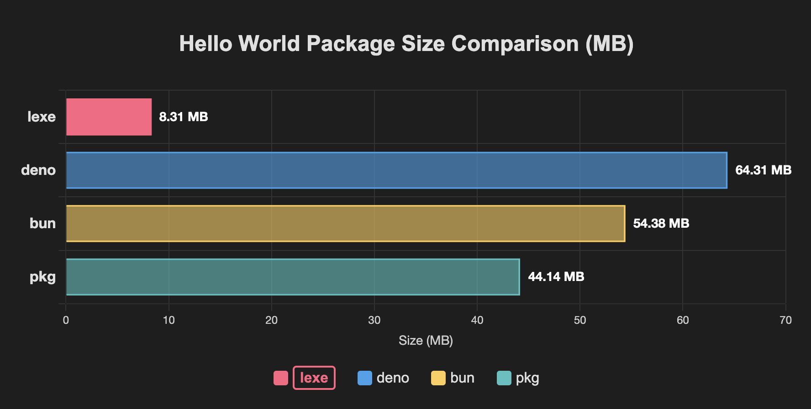

# Lexe
Lexe 是 AWS 轻量级 JavaScript 运行时 "LLRT" 的一个分支。  
您可以使用它将 Node.js 应用程序打包成单个可执行文件，而大小仅为 10MB。



```bash
npx lexe build -i=index.js

npx lexe build -i=index.js -o=binary -d=dist -p=linux-x64,windows-x64
```

选项：
- `-i`: 输入文件（必需）
- `-o`: 输出文件（可选，默认：`<输入文件名>-<平台>`）
- `-d`: 输出目录（可选，默认：`./dist`）
- `-p`: 目标平台，使用","分隔多个平台
  选项：`linux-x64,linux-arm64,darwin-x64,darwin-arm64,windows-x64`
  （可选，默认：当前平台）

> [!IMPORTANT]
> 请注意，Lexe(or LLRT) 目前并不支持完整的 http 和 https 模块，而是实现了 `fetch` 用于请求，`net` 用于搭建低层级的网络服务
> 在 LLRT team 的 ROADMAP 中，http 和 https 模块是 [2025 年的目标之一](https://github.com/awslabs/llrt/issues/635)
> 所以我目前不推荐使用 Lexe 来搭建 HTTP 服务，而是用于创建 CLI 工具

> [!WARNING]
> Lexe 不是 Node.js 的完全替代品。它只支持 Node.js API 的一个子集。  
> 您可以在 [LLRT README](https://github.com/awslabs/llrt) 中了解更多关于 LLRT 的信息  
> 由于 Lexe 是 LLRT 的一个分支，以下文档基本上是 LLRT 的副本

## 兼容性矩阵

| 模块            | Node.js | LLRT ⚠️ |
| -------------- | ------- | ------- |
| assert         | ✔︎     | ✔︎️    |
| buffer         | ✔︎     | ✔︎️    |
| child_process  | ✔︎     | ✔︎⏱   |
| console        | ✔︎     | ✔︎     |
| crypto         | ✔︎     | ✔︎     |
| dns            | ✔︎     | ✔︎     |
| events         | ✔︎     | ✔︎     |
| fs/promises    | ✔︎     | ✔︎     |
| fs             | ✔︎     | ✘⏱     |
| http           | ✔︎     | ✘⏱\*\* |
| https          | ✔︎     | ✘⏱\*\* |
| net:sockets    | ✔︎     | ✔︎⏱   |
| net:server     | ✔︎     | ✔︎     |
| os             | ✔︎     | ✔︎     |
| path           | ✔︎     | ✔︎     |
| perf_hooks     | ✔︎     | ✔︎     |
| process        | ✔︎     | ✔︎     |
| streams        | ✔︎     | ✔︎\*   |
| string_decoder | ✔︎     | ✔︎     |
| timers         | ✔︎     | ✔︎     |
| tty            | ✔︎     | ✔︎     |
| url            | ✔︎     | ✔︎     |
| util           | ✔︎     | ✔︎     |
| tls            | ✔︎     | ✘⏱     |
| zlib           | ✔︎     | ✔︎     |
| 其他模块        | ✔︎     | ✘       |

| 特性          | Node.js | LLRT ⚠️ |
| ----------- | ------- | ------- |
| async/await | ✔︎     | ✔︎     |
| encoding    | ✔︎     | ✔︎     |
| fetch       | ✔︎     | ✔︎     |
| ESM         | ✔︎     | ✔︎     |
| CJS         | ✔︎     | ✔︎     |

_⚠️ = 在 LLRT 中部分支持_<br />
_⏱ = 计划部分支持_<br />
_\* = 非原生_<br />
_\*\* = 请使用 fetch 代替_<br />

## 在 llrt 中使用 node_modules（依赖项）

由于 llrt 旨在用于性能关键型应用程序，不建议在没有打包、压缩和树摇优化的情况下部署 `node_modules`。

llrt 可以与您选择的任何打包工具一起工作。以下是一些流行打包工具的配置：

> [!警告]
> LLRT 实现了与以下外部包基本兼容的原生模块。
> 通过在打包工具的别名函数中实现以下转换，您的应用程序可能会更快，但我们建议您进行彻底测试，因为它们并不完全兼容。

| Node.js         | LLRT      |
| --------------- | --------- |
| fast-xml-parser | llrt:xml  |
| uuid            | llrt:uuid |

### ESBuild

```shell
esbuild index.js --platform=browser --target=es2023 --format=esm --bundle --minify --external:@aws-sdk --external:@smithy
```

### Rollup

```javascript
import resolve from "@rollup/plugin-node-resolve";
import commonjs from "@rollup/plugin-commonjs";
import terser from "@rollup/plugin-terser";

export default {
  input: "index.js",
  output: {
    file: "dist/bundle.js",
    format: "esm",
    sourcemap: true,
    target: "es2023",
  },
  plugins: [resolve(), commonjs(), terser()],
  external: ["@aws-sdk", "@smithy"],
};
```

### Webpack

```javascript
import TerserPlugin from "terser-webpack-plugin";
import nodeExternals from "webpack-node-externals";

export default {
  entry: "./index.js",
  output: {
    path: "dist",
    filename: "bundle.js",
    libraryTarget: "module",
  },
  target: "web",
  mode: "production",
  resolve: {
    extensions: [".js"],
  },
  externals: [nodeExternals(), "@aws-sdk", "@smithy"],
  optimization: {
    minimize: true,
    minimizer: [
      new TerserPlugin({
        terserOptions: {
          ecma: 2023,
        },
      }),
    ],
  },
};
```
## 在 LLRT 中运行 TypeScript

使用 TypeScript 时也适用与依赖项相同的原则。TypeScript 必须打包并转译为 ES2023 JavaScript。

> [!注意]
> LLRT 不会支持在不进行转译的情况下运行 TypeScript。这是出于性能原因的设计。转译需要在执行过程中消耗 CPU 和内存，增加延迟和成本。如果在部署前提前完成，可以避免这些问题。

## 原理

在已有的选项如 [Node.js](https://nodejs.org/en), [Bun](https://bun.sh) 和 [Deno](https://deno.com/) 的情况下，为什么要引入另一个 JavaScript 运行时？

Node.js、Bun 和 Deno 都是非常优秀的 JavaScript 运行时。然而，它们是为通用应用程序设计的。这些运行时并不是专门为无服务器环境的需求而定制的，无服务器环境的特点是运行时实例的生命周期较短。它们都依赖于 ([即时编译器 (JIT)](https://en.wikipedia.org/wiki/Just-in-time_compilation)) 在执行过程中进行动态代码编译和优化。虽然 JIT 编译提供了显著的长期性能优势，但它会带来计算和内存开销。

相比之下，LLRT 的显著特点是不包含 JIT 编译器，这一战略决策带来了两个重要优势：

A) JIT 编译是一个非常复杂的技术组件，会增加系统复杂性，并大幅增加运行时的整体大小。

B) 没有 JIT 开销，LLRT 可以节省 CPU 和内存资源，将其更有效地分配给代码执行任务，从而减少应用程序启动时间。

## 局限性

在许多情况下，与支持 JIT 的运行时相比，LLRT 显示出明显的性能劣势，例如大型数据处理、蒙特卡洛模拟或执行数十万或数百万次迭代的任务。LLRT 最有效的应用是在较小的无服务器函数上，专门用于数据转换、实时处理、AWS 服务集成、授权、验证等任务。它的设计是对现有组件的补充，而不是作为所有组件的全面替代品。值得注意的是，由于其支持的 API 基于 Node.js 规范，切换回替代解决方案只需要最小的代码调整。

## 环境变量

### `LLRT_EXTRA_CA_CERTS=file`

从 PEM 编码文件加载额外的证书颁发机构

### `LLRT_GC_THRESHOLD_MB=value`

为垃圾收集设置内存阈值（MB）。默认阈值为 20MB

### `LLRT_HTTP_VERSION=value`

扩展 HTTP 请求版本。默认情况下，只启用 HTTP/1.1。指定 '2' 将启用 HTTP/1.1 和 HTTP/2。

### `LLRT_LOG=[target][=][level][,...]`

按目标模块、级别或两者（使用 `=`）过滤日志输出。日志级别不区分大小写，并且也会启用任何更高优先级的日志。

日志级别按优先级降序排列：

- `Error`
- `Warn | Warning`
- `Info`
- `Debug`
- `Trace`

过滤器示例：

- `warn` 将启用所有警告和错误日志
- `llrt_core::vm=trace` 将启用 `llrt_core::vm` 模块中的所有日志
- `warn,llrt_core::vm=trace` 将启用 `llrt_core::vm` 模块中的所有日志以及其他模块中的所有警告和错误日志

### `LLRT_NET_ALLOW="host[ ...]"`

以空格分隔的主机或套接字路径列表，这些主机或套接字路径应该允许进行网络连接。对于不在此列表中的任何主机或套接字路径，网络连接将被拒绝。设置空列表拒绝所有连接

### `LLRT_NET_DENY="host[ ...]"`

以空格分隔的主机或套接字路径列表，这些主机或套接字路径应该拒绝网络连接

### `LLRT_NET_POOL_IDLE_TIMEOUT=value`

为保持活动状态的空闲套接字设置超时时间（秒）。默认超时时间为 15 秒

### `LLRT_PLATFORM=value`

用于显式指定 Node.js 包解析器的首选平台。默认值为 `browser`。如果指定了 `node`，则在搜索路径中 "node" 优先。如果指定了 `browser` 或 `node` 以外的值，它将表现得像指定了 "browser"。

### `LLRT_TLS_VERSION=value`

设置用于网络连接的 TLS 版本。默认情况下只启用 TLS 1.2。通过将此变量设置为 `1.3`，还可以启用 TLS 1.3

## 基准测试方法

虽然 [Lambda 报告的](https://docs.aws.amazon.com/lambda/latest/dg/lambda-runtime-environment.html) 初始化持续时间通常用于了解冷启动对整体请求延迟的影响，但此指标不包括将代码复制到 Lambda 沙箱所需的时间。

初始化持续时间的技术定义（[来源](https://docs.aws.amazon.com/lambda/latest/dg/nodejs-logging.html#node-logging-output)）：

> 对于第一个处理的请求，是指运行时加载函数并在处理程序方法之外运行代码所花费的时间。

测量往返请求持续时间可以提供更完整的用户面对冷启动延迟的情况。

Lambda 调用结果（λ 标记的行）报告初始化持续时间 + 函数持续时间的总和。

## 许可证

此库根据 Apache-2.0 许可证获得许可。请参阅 [LICENSE](LICENSE) 文件。 